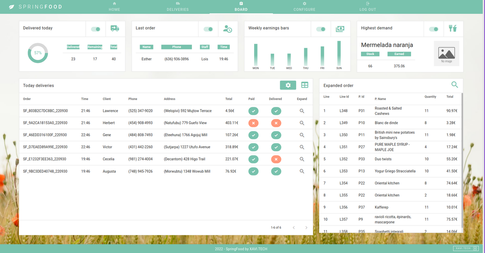

<h1> SpringFood (Pre-Alpha) </h1>Cancel changes

<h2> About SpringFood </h2>

SpringFood is a <strong>delivery management Web-App</strong> that allows you to manage products, stock, orders and workers with different roles. 

The intention behind this project is just to learn how to develop with SpringBoot and VUE. So, <strong>the development is slow, since I can only dedicate to it in my spare time</strong>.

[]

<h4>It is divided in two sections:</h4>

- <strong>The customers section.</strong> They can place orders, select delivery place and time, pay with credit card (with Stripe) or leave them as a pending payment.

- <strong>The workers section.</strong> Workers can have different permissions, depending on which ones have been assigned to them by the administrators. 

	Possible functions that can be accessed by the workers are:
	
		- Delivering __(UD.)_
		- List orders by criteria
		- List clients by criteria __(UD.)_
		- Manage the catalog
		- Create and modify products name, image, price, stock configuration...
		- Configurar tienda (horarios y tiempos de entrega disponibles)

